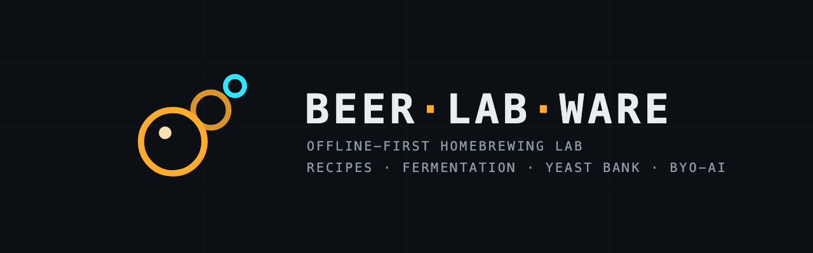
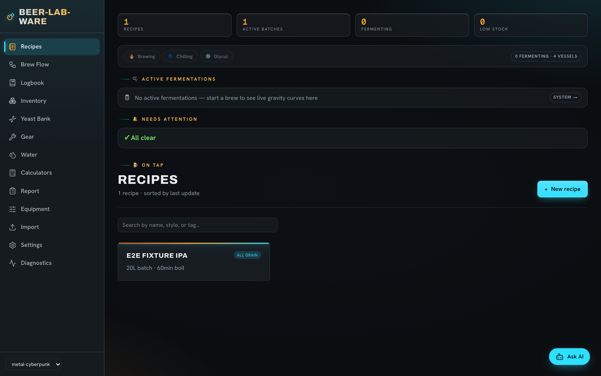
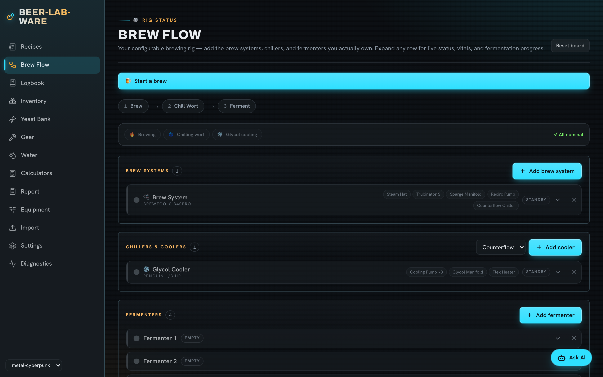
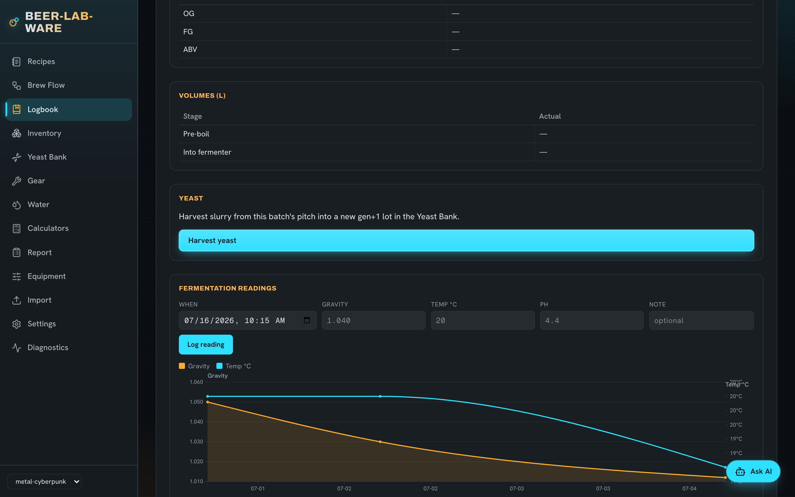
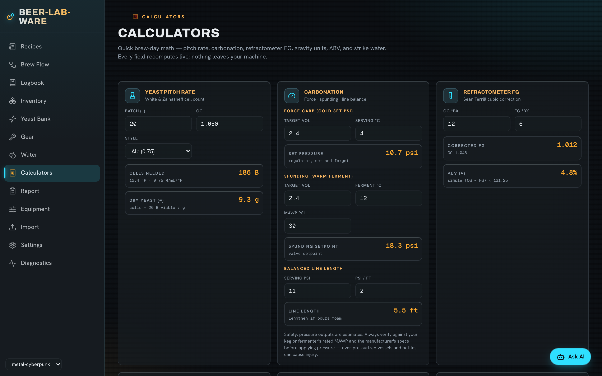

# 🍺 Beer-Lab-Ware

[](https://github.com/public-n0cs-code/beer-lab-ware/actions/workflows/ci.yml)




**A local-first homebrewing app for recipes, brew day, and fermentation — no account, no server, no subscription.**

Beer-Lab-Ware is a Progressive Web App for homebrewers who want real recipe math, a guided brew day, and fermentation tracking without handing their data to a cloud service. Everything lives in your browser by default; nothing is required to sign up, and nothing phones home.

## Try it

**[Open the live app →](https://public-n0cs-code.github.io/beer-lab-ware/)**

1. Open the link.
2. Install it — **Install app** in the browser menu (desktop) or **Add to Home Screen** (phone).
3. Brew. It works offline from then on, brew day included, and your data stays in your browser.

Want your own copy on your own domain? Grab the prebuilt static bundle from the
[latest release](https://github.com/public-n0cs-code/beer-lab-ware/releases) and drop it on
any web server — or one-click deploy:

[](https://app.netlify.com/start/deploy?repository=https://github.com/public-n0cs-code/beer-lab-ware)
[](https://vercel.com/new/clone?repository-url=https://github.com/public-n0cs-code/beer-lab-ware)

## What it looks like

| | |
|---|---|
|  |  |
| *Brewhouse dashboard — KPIs, live fermentations, attention nudges* | *Brew Flow — model the rig you actually own* |
|  |  |
| *Batch sheet — readings log + dual-axis fermentation chart* | *Calculators — pitch rate, carbonation, refractometer, strike water* |

## Features

- **Recipes** — a full recipe editor with real-time OG/FG/ABV/IBU/SRM calculations, BJCP style overlays, and BeerXML import/export.
- **Brewfather migration** — import your Brewfather JSON export (recipes, batches with fermentation readings, and ingredient inventory) with a dry-run preview; re-importing never duplicates.
- **Brew flow** — a guided, step-by-step brew day that walks you through mash, boil, and additions in order.
- **Fermentation logging + charts** — log gravity and temperature readings over the course of a fermentation and see them plotted.
- **Inventory** — track fermentables, hops, yeast, and misc ingredients, and draw them down as you brew.
- **Yeast Bank** — a harvest → repitch lineage tracker: capture a slurry harvest from a batch, follow it through generations, and see viability decay over time.
- **BYO-AI brewing companion** — an optional AI assistant that can answer questions about your recipes and batches and propose changes for you to review. Bring your own API key; see below.

## Runs anywhere, keeps working offline

Beer-Lab-Ware is a **static, local-first PWA**. There's no backend to stand up and no account to create — install it from the hosted instance, deploy your own copy, or run it locally. Install it to your phone or desktop home screen and it keeps working offline, brew day included.

> **Backups matter:** browsers can evict local data under storage pressure — especially
> iOS Safari when the app is used in a tab rather than installed. Install the app,
> and use **Settings → Backup** regularly (it's one click). See [`PRIVACY.md`](./PRIVACY.md)
> and [`TERMS.md`](./TERMS.md) for the full data story.

## BYO-AI companion

The AI companion is opt-in. Bring your own API key — Anthropic or any OpenAI-compatible endpoint (including local model servers) — and it's stored in your browser's local storage. The key is never sent anywhere except directly to the provider you configured, and it never touches any server this project runs.

## Sync tiers

- **Local-only (default, for everyone):** your data lives in the browser's local database. No setup required.
- **Multi-device sync (self-hosted):** end-to-end usable. Stand up the sync daemon on a server you control ([`docs/deploy/`](./docs/deploy/README.md) has the templates and runbook), then connect the app in **Settings → Sync**: enter the server URL (https required; http allowed only for localhost) and your per-device token, hit **Test connection**, and **Sync now**. The default mode is safe two-way sync (pull → merge → push, with deletion tombstones, deterministic conflict reconciliation, and ETag optimistic concurrency); an Advanced disclosure offers one-way modes — *pull only* ("phone follows the server") and *push only* ("this desktop is canonical"). **Diagnostics** shows live sync status: reachability, dump-version compatibility, token check, and the last sync outcome. The URL and token are stored only on the device — never in backups, never in the synced data itself.

Local-first is permanent: any sync or hosted tier will always be optional, and the app will always work fully with no account and no server.

## MCP server

The repo ships an [MCP](https://modelcontextprotocol.io) stdio server so AI clients
(Claude Code, Claude Desktop, Cursor, …) can read — and, with explicit approval,
write — an exported brewery file. See [`docs/mcp.md`](./docs/mcp.md).

## Getting started (development)

You'll need Node 22 or 24 (see `.nvmrc`).

```bash
npm install
npm run dev       # dev server with hot reload
```

Build a static export:

```bash
npm run build
```

## Contributing

Bug reports, feature ideas, and pull requests are welcome — see [`CONTRIBUTING.md`](./CONTRIBUTING.md) for setup, checks, and the DCO sign-off. Release history lives in [`CHANGELOG.md`](./CHANGELOG.md); security reports go through [`SECURITY.md`](./SECURITY.md).

## License, terms & privacy

Code is MIT — see [`LICENSE`](./LICENSE). Style vital statistics are derived from
the [BJCP 2021 Style Guidelines](https://www.bjcp.org/style/2021/) and remain
subject to BJCP's terms — see [`NOTICE`](./NOTICE). The Beer-Lab-Ware name and
logo are project identity and are not covered by the MIT code grant.

Plain-language use terms (including the safety note on pressure calculators) are
in [`TERMS.md`](./TERMS.md). The privacy story — the app doesn't phone home — is
in [`PRIVACY.md`](./PRIVACY.md).

---

Made for homebrewers — from Zero-Day Brewery.
